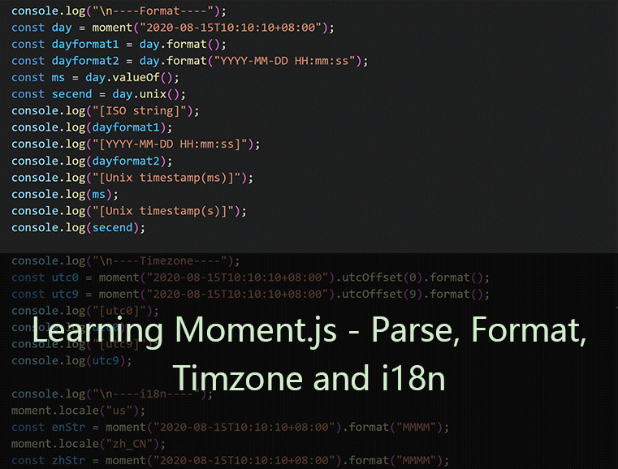

# 学会Momentjs的使用--解析、格式化、时区和本地化

Momentjs是比较常用的日期库，比原生Date类多了很多好用的特性。支持ES6模块化导入，有完整类型声明。

## 安装

```sh
yarn add moment
```

## 测试调试

简单尝试可以新建html引入js，在浏览器控制台调试：

```html
<script src="https://cdnjs.cloudflare.com/ajax/libs/moment.js/2.27.0/moment-with-locales.min.js"></script>
<script>
    window.onload = function () {
        console.log(moment().format());
    };
</script>
```

注意：这里直接引入了带本地化最小版cdn文件。

也可以新建ts项目，正式加断点详细调试。这里准备好了html文件和样例的ts项目，可以直接动手运行。戳~[Github样例源码](https://github.com/czzonet/momentjs-simple)

## 使用

先看一个对比Date的简单例子：

```sh
import moment from "moment";

const now = moment()
console.log(now.format());

const nowDate = new Date()
console.log(nowDate.toISOString());
```

解释：

- 导入momentjs，以es6模块形式导入。
- 使用moment方法生成一个时间对象，无参数则默认当前时间。
- 使用format方法格式化输出。
- 新建一个Date对象。
- 输出Date对象字符串。

输出：

```sh
2020-09-04T13:02:57+08:00
2020-09-04T05:02:57.820Z
```

分析：

这两种是等价的`ISO 8601`格式的日期字符串，moment默认当地的时区，这会在本后面时区细讲。

### 解析生成

可以从日期字符串、unix时间戳等等新建时间对象。

```ts
const day1 = moment("2020-08-15T10:10:10+08:00");
const day2 = moment(1597457410000);
const day3 = moment.unix(Math.floor(1597457410000 / 1000));
```

解释：

- 解析`ISO 8601`格式的日期字符串
- 解析unix时间戳（毫秒）
- 解析unix时间戳（秒）

### 格式化输出

使用format方法来输出格式化字符串：

```ts
const day = moment();
day.format();
day.format('YYYY-MM-DD HH:mm:ss');
```

输出：

```ts
2020-08-15T10:10:10+08:00
2020-08-15 10:10:10
```

解释：

- 默认输出`ISO 8601`格式的日期字符串
- 格式化字符串，注意**分秒只有小写**。
  - YYYY 1970 1971 ... 2029 2030
  - MM 01 02 ... 11 12
  - DD 01 02 ... 30 31 
  - HH 00 01 ... 22 23 
  - mm 00 01 ... 58 59
  - ss 00 01 ... 58 59

还可以输出unix时间戳：

```ts
day.valueOf();
day.unix();
```

解释：

- unix时间戳（毫秒）
- unix时间戳（秒）

### 时区

*注意：不同时区的写法仍然代表同一个时刻，但是在生成和输出不带时区的时刻时，注意当前隐含的时区。*

使用utcOffset方法进行时区转化：

```ts
moment("2020-08-15T10:10:10+08:00").utcOffset(0).format();
moment("2020-08-15T10:10:10+08:00").utcOffset(9).format();
```

输出：

```ts
2020-08-15T02:10:10Z
2020-08-15T11:10:10+09:00
```

解释：

- 转化到0时区
- 转化到东九区

注意，utcOffset值范围在-16~+16时看作小时数，范围外看作分钟数。

如果想在全球时间通过**地名**相互转换，推荐使用全球时区库：[Moment Timezone | Home](https://momentjs.com/timezone/)

### 本地化

使用moment.locale()方法进行本地化：

```ts
moment.locale("us");
const enStr = moment("2020-08-15T10:10:10+08:00").format("MMMM");
moment.locale("zh_CN");
const zhStr = moment("2020-08-15T10:10:10+08:00").format("MMMM");
```

输出：

```ts
August
八月
```

解释：

- 设置为美国地区，格式化输出月份
- 设置为中国地区，格式化输出月份

注意，对moment调用locale方法本地化会影响局部默认，而对实例调用locale方法只会修改该实例。

区分：本地化和时区是两个概念，互不影响。

大小：本地化需要多种语言资源比较占空间，所以需要按需引入或者只使用不带本地化的版本来减小体积。

## 总结

Momentjs日期库能够提供原生Date没有的功能，而且类型支持比较完善。文档比较长，还是值得看看了解一下的。对于想动手实践的，这里准备好了html文件和样例的ts项目，可以直接动手运行。戳~[Github样例源码](https://github.com/czzonet/momentjs-simple)

## 参考

1. [Moment.js | Home](https://momentjs.com/)
2. [Moment Timezone | Home](https://momentjs.com/timezone/)
3. [Github样例源码](https://github.com/czzonet/momentjs-simple)
